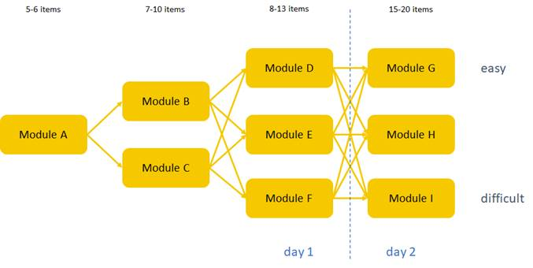

```{r libraries, include=FALSE}
library(tidyverse)
library(Hmisc)
library(gtsummary)
library(knitr) 
source("C:/Users/nikol/Desktop/MSc MSBBSS/Year-2_2021-2022/Internship/repo/mst/simulation/ref-score&classification-functions.R")
```

# **Introduction**
 
*Multistage tests* (MSTs), are said to be "the best of both worlds" when compared to the traditional *Linear Tests* (LTs) on the one hand, and *Computerized Adaptive Tests* (CATs) on the other. They allow for adaptation of the difficulty based on the level of proficiency, without many of the shortcomings that follow when using completely adaptive tests (such as CAT). Briefly, many of the problems that CAT's face, such as the lack of control over item ordering, not being easily applicable to essay items, no possibility of reviewing, difficulty of programming, are compensated for when using MST's. Multistage tests can be seen as a series of small sequential batches of items (called *modules*), where, based on the proficiency estimated in one module, an appropriately difficult following module is administered. Every specific combination of modules can be seen as a separate booklet, which implies that different students (with varying levels of proficiency) can follow different paths (which can be seen as booklets). For more details on MST's, see, for example @yan2016computerized pp 3-20. 
The particular MST that that is studied here is called **ACET** (*Dutch*: Adaptive Centrale Eindtoets), which was developed by [Cito](https://www.cito.com/) for the classification of students on different levels (also called classes) of secondary education. **ACET** is comprised of  three separate MST's for measuring *Reading (Lezen)*, *Mathematics (Rekenen)* and *Language proficiency (Taal)*, and a linear test for *Writing (Schrijven)* (throughout this report the Dutch names for the subjects are used). The final score of *ACET* is calculated as a composite of the four resulting ability estimates on the four subjects. The MST design for the all three subjects is presented below.
  
```{r ACET, out.width = "70%", fig.align = 'center', echo=FALSE, cache=TRUE}

``` 
Knowing how MST's (and adaptive tests in general) work, it is only logical to ask the question how fair are these tests when estimating the final ability of the students. More specifically, what happens when, for example, a highly proficient student makes mistakes in the early stages of the MST, and as a result is routed thorough a easier path? In other words: *to what extent can students "recover" from mistakes made in an earlier stage(s) and still reach an estimate close to their true ability*. This is the research question that is tackled in the work presented in this report in order to try to answer this issue specifically of *ACET*. 
**ACET** consists of multiple versions for each module on all three subjects. In order to keep the simulation as simple as possible,  a special version of the MST developed for hearing impaired students will be used which only contains one version per module.  Throughout this report the terms ability, proficiency and $\theta$ (which is the Greek symbol used in [IRT](https://en.wikipedia.org/wiki/Item_response_theory) to represent the latent ability) are used interchangeably. In an effort to answer the research question for this project, two simulations studies were conducted.

This report is divided as follows. In the next section the first (initial) simulation, undertaken to explore how these particular MSTs function when we "know" the true ability of the students is presented and results from initial statistical analyses are briefly presented. Afterwards, the number of errors in Module A and in Day 1 are calculated and visual representation of the difference btwetn the true and re-estimated ability are given fro all three subjects. Also, the number of different paths, with a special focus on the students located on the extremes of the latent ability distribution is presented and discussed. In the end of this section, in a small statistical "experiment" it is explored whether there are significant differences in the difference between the true and the re-estimated proficiency between the three subjects when controlling for different excoriates. In the section afterwards, using the observed data from ACET 2021, we repeat the simulation using the ....(finish this after finishing the actual sections).
All the code used to obtain the results presented in this report is openly available on [GitHub](https://github.com/sekulovskin/recovery-MST-Cito). Note, due to the nature of the simulations (more specifically the way the multuple MST responses are generated), exact replications are not possible (even when using the same random seed), thus the results might slightly vary. However, the simulations were repeated many times, and roughly the same results were observed.

# **Initial (exploratory) simulation**

## Outline of the simulation study

```{r data from sim 1, include=FALSE}
load("C:/Users/nikol/Desktop/MSc MSBBSS/Year-2_2021-2022/Internship/repo/mst/simulation/initial.simulated.responses.RData")
```
   
 In this section, the results from the analyses based on the first simulation will be presented. Using the observed distributions of the abilities from the 2021 administration of **ACET** and adding the theoretically possible extreme values on the edges (which otherwise weren't likely to be simulated when using the observed distributions), 200  $\theta$ values for each subject were generated, and treated as the true abilities of 200 artificial students. A summary of these ability distributions is presented below. 
 
```{r summary of thetas, echo=FALSE, fig.cap= "True ability distributions based on the observed results from ACET 2021"}
thetas <- data.frame(true.theta_L, true.theta_R, true.theta_T)
names(thetas) <- c("Lezen", "Rekenen", "Taal")
tbl_summary(thetas, statistic = list(all_continuous() ~ "{mean} ({sd}) [{min}, {max}]"))
```

 Afterwards, **ACET's** test design, routing rules and the item parameters, for each subject, were used to generate a 1000 MST responses for each artificial student (i.e., for each true $\theta$). These responses were simulated using the `sim_mst` function from the package `dexterMST` [@dextermst], which simulates data from an Extended Nominal Response Model. Afterwards, using the `ability` function from the package `dexter` [@dexter], re-estimates of the true ability were obtained with Weighted Likelihood Estimation (WLE) for all 1000 simulated responses for the 200 students for each of the three subjects. This plethora of responses for each level of ability allows to, separately,  explore how the ability estimate for each of the three subjects changes when certain factors, such as the number of mistakes in module A, the number of mistakes in Day 1 and different MST paths are varied. 

## Initial analyses

 In order to preliminary inspect whether different patterns produced by the multiple simulated responses for each level of the true ability lead to differences between the true and the re-estimated $\theta$ simple [Welch's Tests](https://en.wikipedia.org/wiki/Welch%27s_t-test) were executed comparing each true $\theta$ and the mean of the re-estimated $\theta's$  for each subject. Briefly, the goal here is to inspect whether there is a *statistically significant* difference between the true and the average of the re-estimated $\theta's$ for each level of the true ability. However, this is done out of pure exploratory reasons and the p-values are always "taken with a grain of salt", since they can be quite misleading, especially when having a big sample size (which in this case is a 1000 - the number of simulations), the interested reader is refereed to @cohen1994earth for further elaborations the issues with standard Null Hypothesis Testing. Since we are dealing with a "large enough" sample size we will use the value of $\alpha = .01$ as a cutoff for whether a mean difference is significant.
 
#### Lezen

```{r p-values Lezen, echo=FALSE, fig.cap= "Mean, SD, and 98% interval of the p-values for Lezen"}
lezen_welch <- lapply(students_abilities_L, function(x){t.test(x[,4],x[,5])})
p <- data.frame()
  for(i in 1:length(true.theta_L)){
    p[i,1] <- lezen_welch[[i]]$p.value 
  }
names(p) <- "p values"
tbl_summary(p, statistic = list(all_continuous() ~ "{mean} ({sd}) [{p1}, {p99}], "))
```

As can be seen from the results presented in the table above, the mean p-value is quite high (0.48) however the lower bound of the 98% interval contains the value of .01, indicating that there are some instances for which true $\theta's$  are significantly different from their respective average re-estimated counterparts. 

```{r include=FALSE}
which(p$`p values` <= 0.01)
true.theta_L[c(1,   2,   3,   4,   5,   6,   7,   8,  41,  59,  78, 162, 166, 196, 197, 198, 199, 200)]
transform.ref.score.lezen(true.theta_L[c(1,   2,   3,   4,   5,   6,   7,   8,  41,  59,  78, 162, 166, 196, 197, 198, 199, 200)])
```
More specifically, the observed significant differences were for $\theta$ values of  -2.54, -1.8, -1.5, -1.3, -1.2, -1, -0.9, -0.8, -0.007,  0.08,  0.13, 0.4,  0.43,  1.2,  1.4, 1.7, 2.2 and 3.4, which correspond to reference Lazen scores of  0,  2,  3,  4,  5,  7,  9, 11, 46, 51, 54, 66, 66, 80, 81, 82, 83 and 84, respectively. This indicates that most of the mismatches between the true and the re-estimated ability tend to be on the extreme, however, there are also a few values in the middle of the ability range. 

#### Rekenen

```{r p-values Rekenen, echo=FALSE, fig.cap= "Mean, SD, and 98% interval of the p-values for Rekenen"}
rekenen_welch <- lapply(students_abilities_R, function(x){t.test(x[,4],x[,5])})
p <- data.frame()
  for(i in 1:length(true.theta_R)){
    p[i,1] <- rekenen_welch[[i]]$p.value 
  }
names(p) <- "p values"
tbl_summary(p, statistic = list(all_continuous() ~ "{mean} ({sd}) [{p1}, {p99}], "))
```
The mean p-value for Rekenen is higher than for Lazen roughly indicating less problems with high difference, however the 98% interval still contains the cutoff of 0.01.

```{r include=FALSE}
which(p$`p values` <= 0.01)   
true.theta_R[c( 1,   2,   3,  22,  45,  81,  89,  98, 141, 187, 200)]
transform.ref.score.rekenen(true.theta_R[c(1,   2,   3,  22,  45,  81,  89,  98, 141, 187, 200)])
```
In this case significant differences were found for theta values -1.97, -1.43, -1.17, -0.16, 0.042,  0.21,  0.23,  0.27, 0.5,  0.93 and 1.85 corresponding to reference Rekenen scores of 1,  2,  3, 16, 21, 25, 25, 27, 31, 37 and 40 respectively. 

#### Taal

```{r p-values Taal, echo=FALSE, fig.cap= "Mean, SD, and 98% interval of the p-values for Taal"}
taal_welch <- lapply(students_abilities_T, function(x){t.test(x[,4],x[,5])})
p <- data.frame()
  for(i in 1:length(true.theta_T)){
    p[i,1] <- taal_welch[[i]]$p.value 
  }
names(p) <- "p values"
tbl_summary(p, statistic = list(all_continuous() ~ "{mean} ({sd}) [{p1}, {p99}], "))
```

The mean p-value for Taal is somewhere in between Rekenen and Lezen.
```{r include=FALSE}
which(p$`p values` <= 0.01)   #
true.theta_T[c(1,   2,  35,  40,  50,  80, 114, 126, 151, 173, 197, 198, 199, 200)]
transform.ref.score.taal(true.theta_R[c(1,   2,  35,  40,  50,  80, 114, 126, 151, 173, 197, 198, 199, 200)])
```


Here significant differences were found for $\theta$ values -1.7, -1.3, -0.03,  0.012,  0.07,  0.18,  0.304, 0.36,  0.46, 0.6, 1.4  1.6,  1.8 and  2.12 corresponding to reference Taal scores of 0,  1, 35, 36, 42, 49, 55, 58, 61, 64, 68, 69, 70 and 70 respectively.
  
**Conclusion:** Based on the presented preliminary analyses, we can see that, when we do not control for any variables, and just inspect whether there is a difference between the true and the average of the re-estimated $\theta's$ for each true ability: 
 
 - *Lezen* has the highest magnitude of significant results (having the lowest mean p-value), with 9%  of the true abilities significantly differing from their mean re-estimated counterparts (with most being on the extremes of the latent ability distribution);
 
 - *Rekenen* has the the smallest magnitude of significant results (having the highest mean p-value) with around 5.5 % of the  of the true abilities significantly differing from their mean re-estimated counterparts. However, in this case mismatches were slightly more evenly spread out through the whole continuum;
 
 - *Taal* is somewhere in the middle both in terms of the magnitude of p-values and also in terms of the percentage of $\theta$ values  significantly differing from their mean re-estimated, which in this case was 7%. 
 
Based on this first basic rudimentary analyses on the simulates MST responses, we can conclude that mismatches between the true and the re-estimated proficiency tend to appear, especially for the subject Lezen. These results give reason to continue to explore why this is the case by considering different aspects of the MST, which is done in the sections that follow.


## Number of mistakes 

Since it is in the inherent nature of an MST  that the the performance in the early (or even the first) module is crucial in deciding in which module will a student be routed in the following stage (see, [Introduction section](# **Introduction**)) it is important to consider students responses on the early stages. Thus, `R` scripts that calculate the number of mistakes in Module A *and* the number of mistakes on Day 1 were written and used both in this simulation and in the one presented in the next section.

### Analyses

The repeated re-estimates for all "students" that showed significant differences in the [initial analysis](## Initial analyses) were separated with respect to the number of mistakes in order to see whether the observed significant differences can be attributed to the number of errors (in module A and in day 1). No statistical significance tests were implemented in this situation since the number of replications on different errors (mistake levels) varies a lot, which would've resulted in p-values that make little sense. SO it was decided that only descriptive statistics will be observed

#### Mistakes in Module A

##### **Lezen**
```{r echo=FALSE}
mistakes.modA.lezen <- read.csv("mistakes.modA.lezen.csv")

gsub(0, " ", kable(mistakes.modA.lezen))
```

In this case the topmost and bottommost extreme values (i.e., -2.54 and 3.4) only have the perfect number of errors (6 and 0 respectively) which indicates that the MST has difficulties accurately re-estimating the true abilities, regardless of the performance in the first module (*possibly move this futrher below*). 

##### **Rekenen**

##### **Taal**


#### Day 1

### Plots

 - plots (connect with the (average) item difficulty parameters)
 
## Number of paths per subject


## Statistical Analyses (maybe a better name)

 - Explain the idea
 - Put the assumptions in appendix
 - Give the result and conclusions
 
# **Classification errors (simulation 2)**

## Introduction

## Classification errors and total number of mistakes in modules A

## Threshold values 
 
# **Conclusion**

 - Recommendations on the test design
 - Overall conclusions 
 
# **References**

<div id="refs"></div>

\newpage
# **Appendix**
 